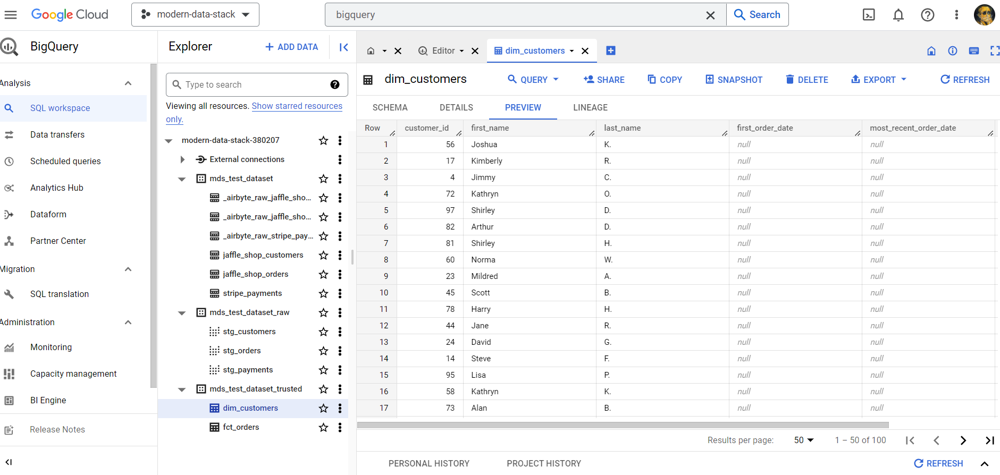

## Introduction

In this article, we'll walk through a proof of concept implementation of a "modern" data stack. The project is based on the following open-source technologies:
* **[Airbyte](https://airbyte.com/)** - for data ingestion
* **[dbt](https://www.getdbt.com/)** - for transforming the data and quality checks
* **[Dagster](https://dagster.io/)** - as an orchestration tool

with **Google BigQuery** acting as a data warehouse (possible to use Databricks, Snowflake or others as well).

The source data is the same as in [Jaffle Shop](https://github.com/dbt-labs/jaffle_shop) dbt example. This project is primarily about integrating our components rather than modeling an actual business case.

**The complete code is available in [this GitHub repo](https://github.com/cogitovirus/gcs-modern-data-stack), along with instructions on how to set it up on your localhost.**

In the sections below you'll find details about how the project is structured and my subjective opinion on the tools it's based on.

Let's jump into it!

## Data flow
Our case is the following. We have three distinct files that will land in an AWS S3 bucket:

```sh
jaffle_shop/
  jaffle_shop_customers.csv
  jaffle_shop_orders.csv
  stripe_payments.csv
```

Those files will be picked up by Airbyte, which will detect their schemas and load the raw data into Google BigQuery tables.

After that, dbt, using the created tables, will run data quality checks, create staging views of our data and finally, execute a SQL business logic to materialize a 'fact' orders table and a consumer 'dimension' table.

Dagster serves here as an orchestrator that will allow us to trigger and monitor the process.

The finished data flow will look as follows:


## Data ingestion
The first step of our data flow is controlled by Airbyte, which stand out as one of the most popular “data movement” platform, with over 10.000+ stars on GitHub and a catalog of 300+ pre-build connectors.

**Interestingly enough**, Google Cloud Storage source is not among them. I would have thought that SFTP, S3, GCS, and whatever storage Azure is doing, would be among the essential source connections. Apparently, Poke-API and CoinGecko Coins connector was higher on the priority list. I guess that’s just how it is with community-driven projects.

That's one of the many reasons why I have mixed feeling about Airbyte. It started with problems with setting it up manually, then came the realization of how UI-heavy it is and that it doesn't have a formal [public API](https://docs.airbyte.com/api-documentation/) that you can interact with. There's also a lack of possibility to keep the configuration as code, other than reverse engineering their API, with [Octavia CLI](https://github.com/airbytehq/airbyte/tree/master/octavia-cli) in the 'alfa' stage, coming to ease this problem. I also had trouble finding any solid benchmarks of how Airbyte performs in production and the ones I found were not encouraging. With little solid proof of how performant it is, I don't know if I would trust it to work on an 'enterprice' level with hundreds of source files, big or small.

In my demo project, my whole Airbyte configuration is automated under `gcs_modern_data_stack/utils/setup_airbyte.py` with a couple of reverse-engineered REST API calls that will set up our three sources (each for every file schema), destination (pointing to the BigQuery schema) and connection between those (that define the schedule, type of replication and give you access to past executions). An example POST call to create a BigQuery destination looks like this:
```python
# gcs_modern_data_stack/utils/setup_airbyte.py
    destination_id = _safe_request(
        client,
        "/destinations/create",
        data={
            "name": "mds_bigquery",
            "destinationDefinitionId": destination_definition_id,
            "workspaceId": workspace_id,
            "connectionConfiguration": {
                    "loading_method": {
                        "method": "Standard"
                    },
                "transformation_priority": "interactive",
                "big_query_client_buffer_size_mb": 15,
                "project_id": BQ_TARGET_CONFIG["project_id"],
                "dataset_id": BQ_TARGET_CONFIG["dataset_id"],
                "dataset_location": "US"
            }
        },
    )["destinationId"]
```
The whole setup can be inspected in the Airbyte UI:


## Data transformation
After our files have arrived in our landing zone schema, it's up to dbt to transform it in any shape or form we'd like. `dbt_project/` holds entirely of it and follows the usual [dbt template structure](https://docs.getdbt.com/guides/best-practices/how-we-structure/1-guide-overview). Most of the fun is happening under the `models/` folder where our source data is first defined along with some basic data quality checks in `src_jaffle_shop.yml`:
```yml
# dbt_project/models/staging/jaffle_shop/src_jaffle_shop.yml
version: 2

sources:
  - name: jaffle_shop
    description: A clone of a Postgres application database.
    schema: mds_test_dataset
    tables:
      - name: jaffle_shop_customers
        description: Raw customers data.
        columns:
          - name: id
            description: Primary key for customers.
            tests:
              - unique
              - not_null

      - name: jaffle_shop_orders
        description: Raw orders data.
        columns:
          - name: id
            description: Primary key for orders.
            tests:
              - unique
              - not_null
        loaded_at_field: _etl_loaded_at
        freshness:
          warn_after: {count: 12, period: hour}
          error_after: {count: 24, period: hour}
```
then materialized as a staging view in `stg_customers`
```sql
-- dbt_project/models/staging/jaffle_shop/stg_customers.sql
with customers as (

    select
        id as customer_id,
        first_name,
        last_name

    from {{ source('jaffle_shop', 'jaffle_shop_customers') }}
)

select * from customers
```
which finally serves as a source to the final trusted table defined in `models/trusted/dim_customers.sql`

```sql
-- dbt_project/models/trusted/dim_customers.sql
with customers as (
    select * from {{ ref('stg_customers')}}
),
orders as (
    select * from {{ ref('fct_orders')}}
),
customer_orders as (
    select
        customer_id,
        min(order_date) as first_order_date,
        max(order_date) as most_recent_order_date,
        count(order_id) as number_of_orders,
        sum(amount) as lifetime_value
    from orders
    group by 1
),
final as (
    select
        customers.customer_id,
        customers.first_name,
        customers.last_name,
        customer_orders.first_order_date,
        customer_orders.most_recent_order_date,
        coalesce(customer_orders.number_of_orders, 0) as number_of_orders,
        customer_orders.lifetime_value
    from customers
    left join customer_orders using (customer_id)
)
select * from final
```

After trying dbt out, I can't say a bad word about it. I'm actually quite impressed. The whole project is focused on doing one thing - transformations - and does it extremely well. With plenty of available out-of-the-box integrations, I've already tried a simple configuration in Databricks, Snowflake, and BigQuery. It might get a bit convoluted with bigger projects, but I believe there is a decent amount of innovation here as well.

One thing that I learned to definitely keep an eye on is full overwrite vs incremental materialization types. With the former being the default. It doesn't really matter with a simple project here, but with hundreds of gigabytes of data coming in, rebuilding all your tables from scratch every time is a close equivalent of sending a cash donation to Amazon AWS.

## Orchestration
Here comes the glue that sticks it all together. Dagster is a data orchestration engine where you can define dependencies between your defined tasks, make sure the whole flows are executed on a given schedule, and troubleshoot any problems in the process. What’s nice in our case is that for dbt and Airbyte, we can import our ops - as Dagster calls it - in batch.
```py
# gcs_modern_data_stack/__init__.py
dbt_assets = load_assets_from_dbt_project(
    project_dir=DBT_PROJECT_DIR, profiles_dir=DBT_PROFILES_DIR
)

airbyty_assets = load_assets_from_package_module(airbyte, group_name="landing")

defs = Definitions(
    assets=[*airbyty_assets, *dbt_assets],
    resources={
        "airbyte": airbyte_resource.configured(AIRBYTE_CONFIG),
        "dbt": dbt_cli_resource.configured(DBT_CONFIG),
    },
    schedules=[
        # update all assets once a day
        ScheduleDefinition(
            job=define_asset_job("all_assets", selection="*"), cron_schedule="@daily"
        ),
    ],
)
```
As you can see, given the dbt project location and profile, the entire project is loaded as an asset in one line. In theory, you could do the same with Airbyte though you might encounter a namespace conflict. Our dbt assets have different namespaces (one of the models is under `stripe/`, and the rest are `jaffle_shop/`), which created a surprising amount of problems with aligning the dependencies. What I ended up doing is separating Airbyte assets into their module where they are loaded individually - precisely how I would like them to:
```py
# gcs_modern_data_stack/assets/airbyte/__init__.py
customers_assets = build_airbyte_assets(
    connection_id=AIRBYTE_CONNECTION_IDS["JAFFLE_SHOP_CUSTOMERS_CONNECTION_ID"],
    asset_key_prefix=["jaffle_shop"],
    destination_tables=["jaffle_shop_customers"]
)

orders_assets = build_airbyte_assets(
    connection_id=AIRBYTE_CONNECTION_IDS["JAFFLE_SHOP_ORDERS_CONNECTION_ID"],
    asset_key_prefix=["jaffle_shop"],
    destination_tables=["jaffle_shop_orders"]
)

payment_assets = build_airbyte_assets(
    connection_id=AIRBYTE_CONNECTION_IDS["STRIPE_PAYMENTS_CONNECTION_ID"],
    asset_key_prefix=["stripe"],
    destination_tables=["stripe_payments"]
)
```

The whole Dagster module consists of a small amount of code, but there's a learning curve for stitching your assets together.

After finishing the local setup, described in the [readme](https://github.com/cogitovirus/gcs-modern-data-stack#readme) you should be able to run the:
```sh
dagster dev
```
and play around in the dagster UI.


You can materialize all assets, drop a new modified file and setup a schedule to kick off a run, or break something intentially and see how dagster deals with errors.

One last thing to do after the successful run is to manually query and inspect if our tables were created in BigQuery.



I can say I'm pleased with the whole Dagster experience and would definitely want to try it out again on a more complicated project. Again, my repeated concern is complexity, where you would have to navigate between hundreds of ops, need to reuse some, etc. I also didn't see a way to group my flow into encapsulated sub-flows.

## Summary
I hope you will find the time to check out the repository and try out the tools on your own. I think it's a good starter to get some feel for those tools. If you are looking for a more step-by-step project, the [dbt fundementals](https://courses.getdbt.com/courses/fundamentals) course will take you through the Jaffle Shop setup I used here as a starter. Dagster also has plenty of examples of integration projects posted [here](https://github.com/dagster-io/dagster/tree/master/examples).

As for me, as a next step, I would like to test how performant dbt actually is compared to PySpark and Spark on Scala. Another item to investigate, in terms of data quality checks, would be a tool that supplements the lack of generic tests in dbt (which only has 4, `unique`, `not_null`, `accepted_values`, and `relationships`) I would like to set something more complex for quality and profiling with PySpark and [deequ](https://github.com/awslabs/python-deequ).


Thanks for reading and see you next time around!